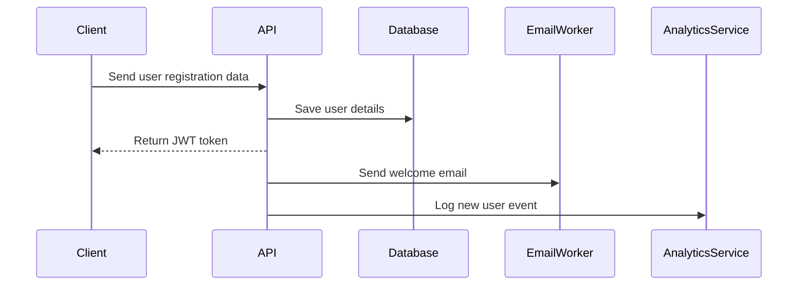

# 👤 User Controller Documentation

## 📌 `POST /register`

**Registers a new user.**

📌 **Full API Details →** [View in Postman](https://www.postman.com/your-workspace/collection/123456)

---

### **🔄 What Happens in the Backend?**

1️⃣ **Validate user input** (email, password).  
2️⃣ **Hash password using bcrypt**.  
3️⃣ **Store user in `users` table**.  
4️⃣ **Generate JWT token and return response**.  
5️⃣ **Send a welcome email using `email-worker`**.  
6️⃣ **Log the event to `analytics-service`**.

---

### **📊 Sequence Diagram**

